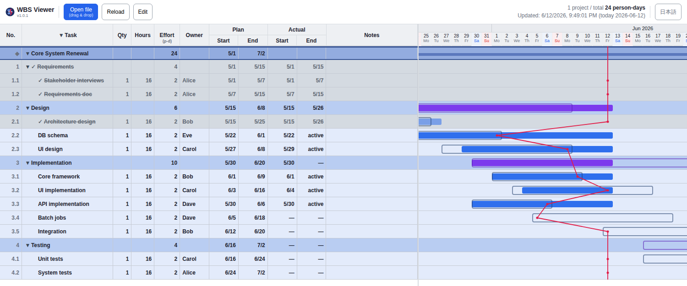
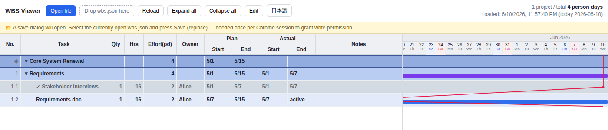
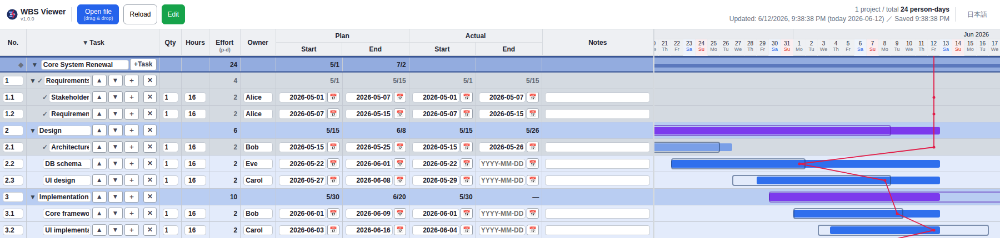

# single-file-wbs

> A dependency-free, single-file WBS / Gantt viewer with a Japanese *inazuma* (slip / progress) line. Just open the HTML in Chrome — no server, no libraries, no build step.

**[日本語版 README はこちら / Japanese README](README.md)**



## Features
- **Single HTML file** — just open `wbs_viewer.html` in Chrome. No server, CDN, build, or dependencies
- **Data is one JSON file** — edit `wbs.json` → press **Reload** to re-render (File System Access API)
- **In-browser editing** — the **Edit** button enables inline editing (date pickers / add, delete, reorder tasks) with autosave back to `wbs.json`
- **Gantt chart** — two-row bars (plan / actual), weekend shading, year-month header, horizontal scroll
- **Inazuma line (progress line)** — start delays and deadline overruns at a glance (bulging left = behind schedule)
- **No state stored in data** — effort = qty × hours ÷ 8 (person-days) is computed automatically; progress is derived internally from actual dates and feeds the inazuma line (not shown as a number)
- **Multiple projects** on a single timeline
- **Collapsible tree** (per project / phase), **completed tasks in gray with ✓**, milestone lines
- **Japanese / English UI** — toggle with the "EN / 日本語" button (choice is remembered)
- **AI-maintainable** — ships with `CLAUDE.md` ([English version](CLAUDE.en.md)). Ask Claude Code to "mark X as done" and it edits the JSON for you (removing the biggest weakness of WBS: the cost of keeping it updated)

## Usage
1. Open `wbs_viewer.html` in Chrome (plain `file://` is fine)
2. Pick `wbs.json` via **Open file** (or drag & drop onto the toolbar)
   — the bundled `wbs.json` is **fictional sample data** (all people and projects are made up); open it as-is to try the tool
3. Edit `wbs.json` and save → press **Reload** to reflect changes
4. Click a project / phase name or `▼/▶` to collapse. **Expand all / Collapse all** buttons available

From **planning** (adding and restructuring tasks, setting and rescheduling dates) to **recording daily actuals** (`actual.start` when work begins, `actual.end` when it finishes), the whole WBS lifecycle happens in this tool. There are three ways to edit — use whichever you like:

1. **In-browser edit mode** (next section) — change things right on screen
2. **Edit `wbs.json` directly** — any text editor, save → press **Reload**
3. **Ask the AI (Claude Code)** — "mark X as done" (see below)

Whichever way you choose, **progress, effort, and the inazuma line are never entered by hand** — they are always computed automatically. No spreadsheet-style formula or percent-complete maintenance, which is the whole point of this tool.

## In-browser editing (optional)

Besides text / AI editing, you can edit directly on screen.

**⚠ Enabling edit mode requires re-selecting the file**

When you press **Edit**, a **file save dialog opens immediately**. This is not a bug: for security, Chrome only grants a page write access to a file when **the user picks that file in a save dialog** (an unavoidable constraint of `file://`-based tools). Steps:

1. Press the **Edit** button → a save dialog opens
2. Select **the same `wbs.json` you currently have open** and press Save
3. "Replace existing file?" → **Yes**
4. When the Edit button turns **green**, you're ready

What the page looks like right after pressing **Edit** (a yellow guidance bar appears; the save dialog opens on top of this):



You do **not** do this every time — only **once after starting Chrome** (required again after restarting Chrome).

**What you can do (while Edit is ON)**

- **Edit any field in place** (task name, qty, hours, owner, notes; dates via a calendar picker)
- **Add** tasks: row `＋` (insert below) / `+Task` on a project row
- **Delete** tasks: `✕` (with confirmation; children included)
- **Reorder**: `▲▼` (move up/down among siblings)
- Changes are **autosaved to `wbs.json` ~0.4 s later**. The save status is always visible at the **top right** ("Saved 12:34:56" etc.)

**Not supported** (edit the JSON directly or ask the AI): drag-and-drop reordering / moving to a different parent / automatic renumbering



## Editing with AI (chat-based maintenance)
The number-one reason WBS charts die is **the cost of updating them**. This tool freezes the view logic (HTML) and treats the data (`wbs.json`) as the only thing that changes — which means you can **delegate updates to Claude Code via chat**.

The repository ships with [`CLAUDE.md`](CLAUDE.md) ([English: `CLAUDE.en.md`](CLAUDE.en.md)), so the AI understands the data format, editing rules, and operating conventions before touching `wbs.json`. Examples:

- "Mark the design review as completed today" → sets `actual.end` of that leaf to today
- "Component placement has started" → sets `actual.start`
- "Add a testing phase" → appends a summary node + leaves
- "Archive everything completed before May" → creates a backup, then removes those tasks

Editing `wbs.json` by hand is of course fine too. The rule of thumb: never touch the HTML, only the data.

## Data format (wbs.json)
```json
{
  "projects": [
    {
      "name": "Project name",
      "milestones": [ { "date": "2026-09-30", "label": "Release", "color": "#ef4444" } ],
      "tasks": [
        { "id": "1", "name": "Phase 1", "children": [
          { "id": "1.1", "name": "Task", "qty": 1, "hours": 16, "assignee": "Owner",
            "plan":   { "start": "2026-07-01", "end": "2026-07-05" },
            "actual": { "start": null, "end": null }, "note": "" }
        ] }
      ]
    }
  ]
}
```
- Tasks nest up to 3 levels. A node with `children` is a summary node; without it, a leaf (carries effort)
- The legacy single-project format `{ "project", "milestones", "tasks" }` is still readable (backward compatible)
- For the full spec, operations, and edge-case handling, see [`CLAUDE.en.md`](CLAUDE.en.md)

## Computation
Effort, progress, and the inazuma line are **all derived automatically from qty, hours, and actual dates** (no derived values stored in the data).
On the inazuma line, **bulging left of the today line = behind schedule**. For exact formulas and conditions, see [`CLAUDE.en.md`](CLAUDE.en.md) (single source of truth for the spec).

## Requirements
Google Chrome (latest). Uses the File System Access API, so Chrome is assumed; works when opened directly via `file://`.

## Tests
`tests/` contains normal-case (`正常_*.json`) and boundary / broken-input (`異常_*.json`) samples (see [`tests/INDEX.md`](tests/INDEX.md)). Design policy: graceful degradation — broken input must never crash the viewer.

## Known limitations
- Initial rendering slows down with thousands of rows (mitigate by collapsing)
- Projects with identical names share collapse state (keep project names unique)
- No keyboard navigation / screen-reader support (mouse-first personal tool)

## License
[MIT](LICENSE)
