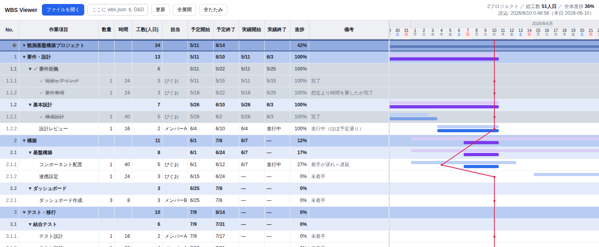
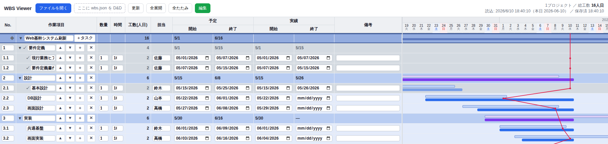

# single-file-wbs

> 単一HTMLで動く、ガントチャート＋**イナズマ線（進捗線）**の WBS ビューア。サーバー・依存ライブラリ・ビルド不要。
> A dependency-free, single-file WBS / Gantt viewer with a Japanese *inazuma* (slip / progress) line. Just open the HTML in Chrome.



## 特徴
- **単一HTMLファイル** — `wbs_viewer.html` を Chrome で開くだけ。サーバー・CDN・ビルド・依存ゼロ
- **データは JSON 1ファイル** — `wbs.json` を編集 →「更新」ボタンで再描画（File System Access API）
- **ブラウザ上でも編集可** — 「編集」ボタンでインライン編集（日付ピッカー／作業の追加・削除・上下移動）→ `wbs.json` に自動保存
- **ガントチャート** — 予定/実績の2段バー、土日グレー、年月ヘッダ、横スクロール
- **イナズマ線（進捗線）** — 着手遅延・終了遅延を折れ線で一目に（左へ突出＝遅延）
- **状態はデータに持たせない設計** — 工数＝数量×時間÷8（人日）は自動計算。進捗は実績日付から内部算出してイナズマ線に反映（数値としては非表示）
- **複数プロジェクト**を1つの時間軸に並べる
- **折りたたみ**（プロジェクト／工程単位）・**完了タスクのグレー＋✓**・マイルストーン線
- **AIチャットで保守可能** — `CLAUDE.md` を同梱。Claude Code / Cursor 等に「○○を完了にして」と頼めば JSON を編集してくれる（WBS最大の弱点＝更新の手間を肩代わり）

## 使い方
1. Chrome で `wbs_viewer.html` を開く（`file://` のままでOK）
2. **「ファイルを開く」** で `wbs.json` を選ぶ（または操作バーへドラッグ&ドロップ）
   ※ リポジトリ同梱の `wbs.json` は**架空のサンプルデータ**です（人物・案件はすべて架空）。そのまま開いて試せます
3. `wbs.json` を編集して保存 → **「更新」** で反映
4. プロジェクト／工程名 or `▼/▶` で折りたたみ。**全展開／全たたみ**ボタンあり

日々の運用で手で触るのは **実績の日付だけ**：着手したら `actual.start`、完了したら `actual.end` を入れる。進捗・工数・イナズマ線は自動で再計算されます。

### ブラウザ上で編集（任意）
テキスト/AI 編集に加え、**「編集」ボタン**で画面から直接編集できます（ONで緑）。各フィールドのインライン編集（日付はピッカー）、リーフの追加（`＋`／プロジェクト行の`＋タスク`）・削除（`✕`）・兄弟内の上下移動（`▲▼`）に対応し、**変更は自動で `wbs.json` に保存**されます（保存状態はヘッダ右上に表示）。ONにする際、書き込み許可のため保存ダイアログで同じ `wbs.json` を選び直します（Chrome 再起動ごとに1回・画面の案内に従ってください）。ドラッグ&ドロップ・親またぎ移動・自動リナンバーは対象外で、それらは JSON か AI 編集で行います。



## AI と一緒に編集（チャット保守）
WBS が続かない最大の理由は **「更新の手間」**。このツールは **表示ロジック（HTML）を固定し、データ（`wbs.json`）だけを編集する**設計なので、**AIコーディングアシスタント（Claude Code / Cursor など）にチャットで更新を任せられます**。

リポジトリには [`CLAUDE.md`](CLAUDE.md) を同梱しており、AI はデータ形式・編集ルール・運用方針を理解した上で `wbs.json` を編集します。例：

- 「設計レビューを今日完了にして」→ 該当タスクの `actual.end` に本日を入れる
- 「コンポーネント配置に着手」→ `actual.start` を入れる
- 「テストフェーズを追加して」→ 集計ノード＋リーフを追記
- 「5月以前の完了をアーカイブして」→ バックアップ作成＋該当タスク削除

もちろん手で `wbs.json` を編集してもOKです。HTML（表示ロジック）は触らず、データだけを更新するのが基本です。

## データ形式（wbs.json）
```json
{
  "projects": [
    {
      "name": "プロジェクト名",
      "milestones": [ { "date": "2026-09-30", "label": "リリース", "color": "#ef4444" } ],
      "tasks": [
        { "id": "1", "name": "フェーズ1", "children": [
          { "id": "1.1", "name": "作業", "qty": 1, "hours": 16, "assignee": "担当",
            "plan":   { "start": "2026-07-01", "end": "2026-07-05" },
            "actual": { "start": null, "end": null }, "note": "" }
        ] }
      ]
    }
  ]
}
```
- タスクは最大3階層のネスト。`children` あり＝集計ノード、なし＝リーフ（工数を持つ）
- 旧形式 `{ "project", "milestones", "tasks" }`（単一プロジェクト）も後方互換で読める
- 詳しい仕様・運用・異常系の扱いは [`CLAUDE.md`](CLAUDE.md) を参照

## 計算ロジック
工数・進捗・イナズマ線は**すべて数量・時間・実績日付から自動計算**されます（データに派生値は持たせない設計）。
イナズマ線は本日線より**左へ突出＝遅延**。計算式・判定条件の正確な仕様は [`CLAUDE.md`](CLAUDE.md) を参照（仕様の単一ソース）。

## 動作環境
Google Chrome（最新版）。File System Access API を使用するため Chrome 前提・`file://` 直開きで動作。

## テスト
`tests/` に正常系（`正常_*.json`）と境界・異常系（`異常_*.json`）のサンプルを同梱（一覧は [`tests/INDEX.md`](tests/INDEX.md)）。壊れた入力でもクラッシュしない（graceful degradation）方針。

## 既知の制限
- 大量行（数千〜）で初期描画が重くなる（折りたたみで緩和）
- 同名プロジェクトは折りたたみ状態が共有される（プロジェクト名は一意に）
- キーボード操作・スクリーンリーダー非対応（マウス前提）

## ライセンス
[MIT](LICENSE)
