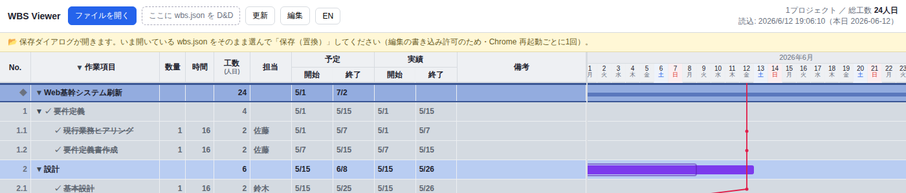

# single-file-wbs

> 単一HTMLで動く、ガントチャート＋**イナズマ線（進捗線）**の WBS ビューア。サーバー・依存ライブラリ・ビルド不要。
> A dependency-free, single-file WBS / Gantt viewer with a Japanese *inazuma* (slip / progress) line. Just open the HTML in Chrome.

**[English README](README.en.md)**


## 特徴
- **単一HTMLファイル** — `wbs_viewer.html` を Chrome で開くだけ。サーバー・CDN・ビルド・依存ゼロ
- **データは JSON 1ファイル** — `wbs.json` を編集 →「更新」ボタンで再描画（File System Access API）
- **ブラウザ上でも編集可** — 「編集」ボタンでインライン編集（日付ピッカー／作業の追加・削除・上下移動）→ `wbs.json` に自動保存
- **ガントチャート** — 予定（枠）に実績（塗りバー）を重ねる**予実オーバーレイ表示**。はみ出し＝遅延が直接見える。土日グレー、年月ヘッダ、横スクロール
- **イナズマ線（進捗線）** — 着手遅延・終了遅延を折れ線で一目に（左へ突出＝遅延）
- **状態はデータに持たせない設計** — 工数（数量×時間÷8・人日）もイナズマ線も自動計算。データに持つのは予定と実績の日付だけで、手でメンテする数字がない
- **複数プロジェクト**を1つの時間軸に並べる
- **折りたたみ**（プロジェクト／工程単位）・**完了タスクのグレー＋✓**・マイルストーン線
- **日本語 / English UI** — 操作バーの「EN / 日本語」ボタンで切替（選択を記憶）
- **AIチャットで保守・一括変更・分析** — 「設計レビューを完了にして」「6月のタスクを1週間後ろ倒し」「担当別の負荷を集計して」が**一言で済む**。`CLAUDE.md` 同梱で Claude Code がデータ形式を理解済み（WBS最大の弱点＝更新の手間を消す）

## 使い方
0. **[Releases](https://github.com/piguo45/single-file-wbs/releases/latest) から `wbs_viewer.html` をダウンロード**（アップデートも新しいファイルを上書きするだけ。`wbs.json` のデータには触れません）
1. Chrome で `wbs_viewer.html` を開く（`file://` のままでOK）
2. **「ファイルを開く」** で `wbs.json` を選ぶ（または操作バーへドラッグ&ドロップ）
   ※ 同梱データは2つ：**`wbs_sample.json`**（架空のサンプル・フォーマットのお手本）と **`wbs_roadmap.json`**（本ツール自身の v1.1 開発計画・実データ。Issue と連動し Claude Code が保守 — 開けば「ツールが自分自身を管理している」様子が見られます）
   自分のデータは `wbs.json` 等の好きな名前で作ってください（ファイル名は自由です）
3. `wbs.json` を編集して保存 → **「更新」** で反映
4. プロジェクト／工程名 or `▼/▶` で折りたたみ。**作業項目ヘッダの `▼/▶`** で全展開・全たたみ（誤操作は **Ctrl+Z** で元の表示に戻せます）

**計画づくり**（タスクの追加・組み替え、予定の設定や引き直し）から**日々の実績記録**（着手したら `actual.start`、完了したら `actual.end`）まで、WBS の運用はすべてこのツール上で行えます。編集のやり方は3つ、好きなものを使えます：

1. **ブラウザの編集モード**（次節） — 画面上でそのまま書き換え
2. **`wbs.json` を直接編集** — テキストエディタで開いて保存 →「更新」
3. **AI（Claude Code）に頼む** — 「○○を完了にして」（後述）

どの方法でも、**工数・イナズマ線だけは手で入力しません** — すべて自動計算です。Excel の WBS のような「集計式のメンテ」が一切不要なのがこのツールの肝です。

## ブラウザ上で編集（任意）

テキスト/AI 編集に加え、画面から直接編集することもできます。

**⚠ 編集を始めるには「ファイルの選び直し」が必要です**

「編集」ボタンを押すと、いきなり**ファイルの保存ダイアログが開きます**。これは故障ではなく、Chrome のセキュリティ上、**ブラウザがファイルに書き込む許可を得るには、保存ダイアログでユーザー自身がファイルを選ぶ必要がある**ためです（file:// で開くツールの宿命です）。手順：

1. **「編集」ボタン**を押す → 保存ダイアログが開く
2. **いま開いている `wbs.json` と同じファイル**をそのまま選んで「保存」
3. 「既存のファイルを置き換えますか？」→ **はい**
4. 編集ボタンが**緑**になれば準備完了

「編集」を押した直後の画面（黄色い案内バーが出ます。この後ろに保存ダイアログが開いています）：



この選び直しは**毎回ではなく、Chrome を起動してから最初の編集ONの1回だけ**です（Chrome を再起動するとまた必要）。

**できること（編集ON中）**

- すべての項目を**その場で書き換え**（タスク名・数量・時間・担当・備考。日付は `YYYY-MM-DD` で直接入力、または 📅 ボタンでカレンダーから選択）
- 作業の**追加**：行の `＋`（すぐ下に追加）／プロジェクト行の `＋タスク`
- 作業の**削除**：`✕`（確認あり・配下ごと削除）
- **並び替え**：`▲▼`（同じ階層内で上下移動）
- 変更は**約0.4秒後に自動で `wbs.json` へ保存**されます。保存できたかは**ヘッダ右上**（「保存済 12:34:56」など）でいつでも確認できます

**できないこと**（JSON 直編集か AI に依頼）：ドラッグ&ドロップでの並び替え／別の親への移動／No.の自動振り直し


## AI と一緒に編集（チャット保守）
WBS が続かない最大の理由は **「更新の手間」**。このツールは **表示ロジック（HTML）を固定し、データ（`wbs.json`）だけを編集する**設計なので、**AIコーディングアシスタント（Claude Code / Cursor など）にチャットで更新を任せられます**。

**AIチャット編集ならではのメリット**

- **プラグイン・連携設定が不要** — データが素の JSON 1枚なので、AI がそのまま読み書きできる（Excel＋AI のような連携の壁がない）
- **一括変更が一言で済む** — 「6月のタスクを全部1週間後ろ倒し」「担当Aの未着手をBに付け替え」のようなまとめ編集
- **工数・傾向の分析を会話で頼める** — 担当別の負荷集計、遅延の傾向、リスクの指摘など、ビューアに無い分析もその場で
- **部分集計・横断集計が自由** — 「設計工程だけの工数合計」「アーカイブや複数の wbs.json を跨いだ実績集計」など、範囲指定もファイル横断も思いのまま

リポジトリには [`CLAUDE.md`](CLAUDE.md) を同梱しており、AI はデータ形式・編集ルール・運用方針を理解した上で `wbs.json` を編集します。例：

- 「設計レビューを今日完了にして」→ 該当タスクの `actual.end` に本日を入れる
- 「コンポーネント配置に着手」→ `actual.start` を入れる
- 「テストフェーズを追加して」→ 集計ノード＋リーフを追記
- 「5月以前の完了をアーカイブして」→ バックアップ作成＋該当タスク削除

もちろん手で `wbs.json` を編集してもOKです。HTML（表示ロジック）は触らず、データだけを更新するのが基本です。

## データ形式（wbs.json）
```json
{
  "projects": [
    {
      "name": "プロジェクト名",
      "milestones": [ { "date": "2026-09-30", "label": "リリース", "color": "#ef4444" } ],
      "tasks": [
        { "id": "1", "name": "フェーズ1", "children": [
          { "id": "1.1", "name": "作業", "qty": 1, "hours": 16, "assignee": "担当",
            "plan":   { "start": "2026-07-01", "end": "2026-07-05" },
            "actual": { "start": null, "end": null }, "note": "",
            "_ai":    { "tokens": 70000, "minutes": 25, "model": "fable-5" },
            "_money": { "outsource": 50000, "currency": "JPY" },
            "_links": ["https://example.com/spec.md"] }
        ] }
      ]
    }
  ]
}
```
- タスクは最大3階層のネスト。`children` あり＝集計ノード、なし＝リーフ（工数を持つ）
- **`_` 始まりのキーはカスタムキー**として自由に追加できる（上例の `_ai`=AI実績・`_money`=外注費・`_links`=参考リンク）。中身の構造も自由。ビューアは無視し、ブラウザ編集の保存でも保持される（任意・無くてよい）。※クリックして開きたいURLは `note` に書く（備考は自動リンク化される）
- 旧形式 `{ "project", "milestones", "tasks" }`（単一プロジェクト）も後方互換で読める
- 詳しい仕様・運用・異常系の扱いは [`CLAUDE.md`](CLAUDE.md) を参照

## 計算ロジック
工数・イナズマ線は**すべて数量・時間・実績日付から自動計算**されます（データに派生値は持たせない設計）。
イナズマ線は本日線より**左へ突出＝遅延**。計算式・判定条件の正確な仕様は [`CLAUDE.md`](CLAUDE.md) を参照（仕様の単一ソース）。

## 動作環境
**Google Chrome（最新版）推奨**。File System Access API を使用するため **Chromium 系ブラウザ専用**・`file://` 直開きで動作。

- **Microsoft Edge** などの Chromium 系ブラウザでも動作します（エンジンが同じため。開発時の検証は Chrome で実施）
- 会社管理のブラウザでは、ポリシーで File System Access が無効化されていると**編集機能が使えない**ことがあります（閲覧は可。`edge://policy` で確認できます）
- Firefox / Safari は**非対応**（File System Access API 未対応）

## テスト
`tests/` に正常系（`正常_*.json`）と境界・異常系（`異常_*.json`）のサンプルを同梱（一覧は [`tests/INDEX.md`](tests/INDEX.md)）。壊れた入力でもクラッシュしない（graceful degradation）方針。

## 既知の制限
- 大量行（数千〜）で初期描画が重くなる（折りたたみで緩和）
- 同名プロジェクトは折りたたみ状態が共有される（プロジェクト名は一意に）
- キーボード操作・スクリーンリーダー非対応（マウス前提）

## ライセンス
[MIT](LICENSE)
