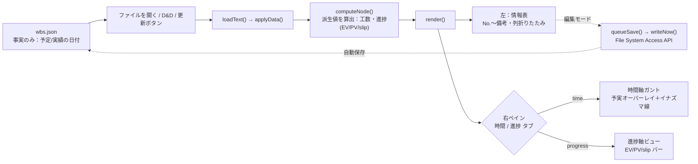
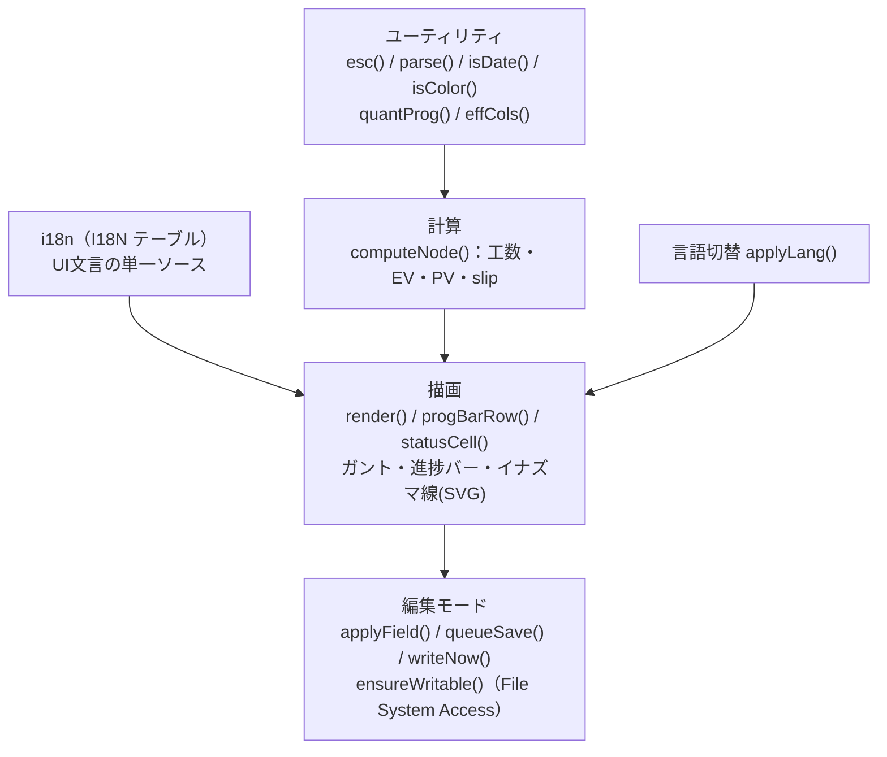

# WBS Viewer 全体概要

`wbs_viewer.html` と周辺ファイルの構成から逆生成した全体像（構成・依存・データの流れ）。

最終更新：2026-06-27

**仕様の単一ソースは [`CLAUDE.md`](../../CLAUDE.md)**（計算式・データ形式・異常系）。本書は重複させず、構成と依存の地図に絞ります。
設計判断の「なぜ」は [ADR（`docs/adr/`）](../adr/) を参照。

---

## コンセプト

> **AIを含む少数精鋭チームを率いる管理者（PL／テックリード）のためのローカルWBS。人間はGUIで、AIは素のJSONと `CLAUDE.md` で、同じ計画を編集する。**

詳細は [`CLAUDE.md` の「製品ビジョン・設計指針（#67）」](../../CLAUDE.md) と [ADR-0004（AIを第一級ユーザーにする）](../adr/0004-ai-first-json-as-api.md)。

---

## リポジトリ構成（ファイルの役割）

| パス | 役割 | 種別 |
|---|---|---|
| `wbs_viewer.html` | 製品本体。単一HTML（CSS+JS内蔵・依存ゼロ）。描画・編集・保存の全機能 | コード |
| `wbs_sample.json` | 架空データの最小サンプル（データ形式の参照用） | データ |
| `wbs_roadmap.json` | 本ツール自身の開発計画（実データ・GitHub Issue連動） | データ |
| `CLAUDE.md` / `CLAUDE.en.md` | 仕様の単一ソース（AI向けAPI仕様も兼ねる） | ドキュメント |
| `README.md` / `README.en.md` | 目的・使い方の入口 | ドキュメント |
| `docs/` | 本書・ADR・スクリーンショット | ドキュメント |
| `tests/` | 正常/異常サンプルJSON＋e2e（headless Chromium）。[ADR-0006](../adr/0006-e2e-headless-chromium.md) | テスト |
| `scripts/refresh_docs_index.py` | `docs/index.md` の自動生成 | ツール |

外部依存・DB・サーバー・定期処理・外部送信は**いずれも無い**（クライアント完結・`file://`・依存ゼロ）。
その判断は [ADR-0001](../adr/0001-dependency-free-single-file.md)。

---

## データの流れ

- **派生値はデータに持たせない**（工数 `qty×hours÷8`・進捗・座標は描画時に算出）。→ [ADR-0003](../adr/0003-no-derived-values-in-data.md)
- **入力経路は1関数に集約**（`loadText()`）。パース失敗は必ずユーザー通知。
- 右ペインは時間/進捗の**片方だけ描画**（非アクティブ側はDOM注入しない）。
- top-level の任意フィールド `holidays` ももう一つの入力。日付ヘッダの祝日着色とガントの土日／祝日列の塗り、残り営業日の算出（祝日除外・#75）に流れる。

---

## HTMLの内部構成（JSの層）

`wbs_viewer.html` 内のJSは「ユーティリティ → 計算 → 描画 → イベント」の順で並ぶ（`front-coding-style` の構成則）。

- **計算ロジック**（工数・進捗率・EVM・親の加重平均）の正は [`CLAUDE.md` 計算ロジック節](../../CLAUDE.md)。
- **編集モードは構造編集も担う**：入れ子（リーフの集計化と、最後の子削除での降格・案Y）とマイルストーンの追加／編集／削除。工数はリーフにのみ宿り、昇格／降格で総量は保存される。→ [ADR-0003](../adr/0003-no-derived-values-in-data.md)
- **保存パスは聖域**（データ消失歴あり）：書込は単一キュー直列化・mtime検知・パース成功後にハンドル差替。→ [ADR-0002](../adr/0002-file-system-access-editing.md)
- **配色はCUD配慮**（Okabe-Ito・形/位置/ラベルで冗長化）。→ [ADR-0005](../adr/0005-cud-color-design.md)

---

## 設計理由が未記録の定数（確認中）

コードに値はあるが「なぜその値か」が未記録のものは、創作せず **#76** に集約して順次確認中：

| 定数・上限 | 場所 | 追跡 |
|---|---|---|
| ネスト上限＝3階層 | `render()` の `walk()` / CSS `.lvl0-2` | #76 |
| 進捗の量子化＝10%刻み | `quantProg()` / `progStep()` | #76 |
| 工数の固定除数＝8時間/日・20日/月 | `computeNode()` / ヘッダ人月換算 | #76 |
| 自動保存デバウンス＝400ms | `SAVE_DEBOUNCE_MS` / `queueSave()` | #76 |
